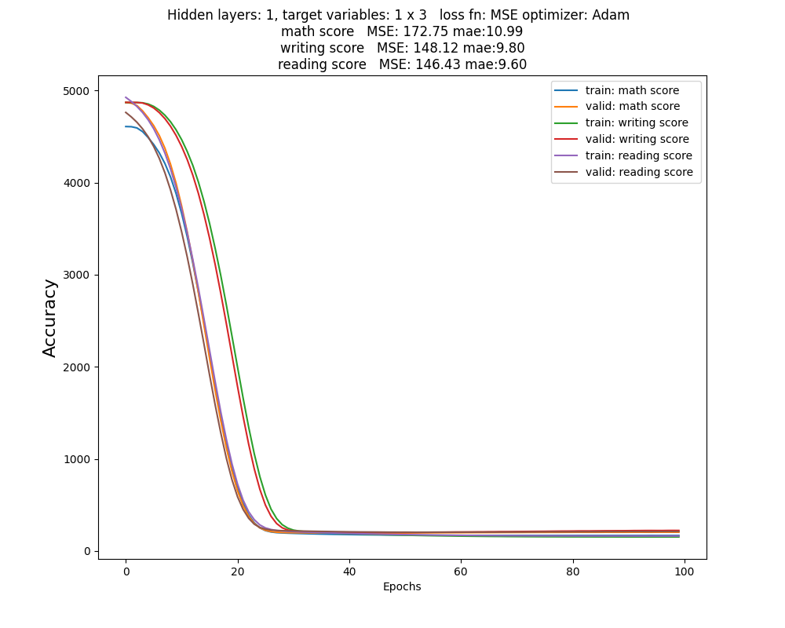

#GradePrediction-Tensorflow
Goal: Given a dataset of student demographics, predict their academic performance.
A regression neural network in Tensorflow is used, after using Pandas to split the dataset into training/test/validation sets. 
Pyplot is used to display each model, plotting their accuracy increasing over time.

# Results

# Installation
1. Ensure dataset file ([StudentPerfomance.csv](https://www.kaggle.com/datasets/spscientist/students-performance-in-exams)) is in the same folder, before running.
2. >pip install -r requirements.txt
3. >python main.py

# Approach
The 3 grade variables being predicted ('math score','writing score','reading score') 
each have separate single variable regression models. All 3 models have 17 size input layers since there are 17 training parameters after one-hot encoding.

# Limitations
* Small dataset 
  * Since the dataset has only 1000 records, it quickly stops improving at around 10% error (MAE), regardless of how the neural network is configured.
  A larger dataset should help accuracy continue improving.
  

  
